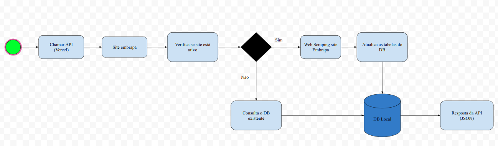
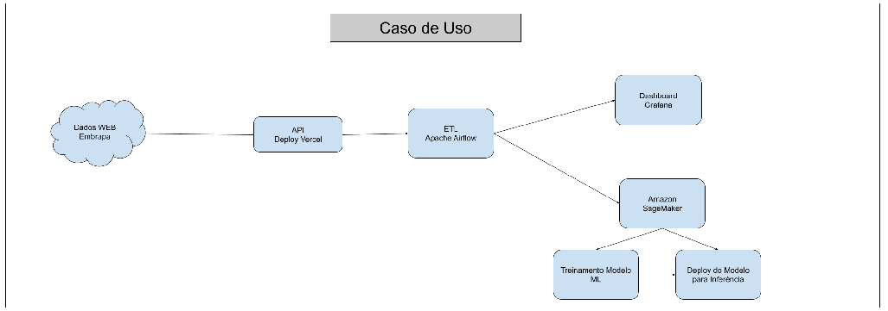

# TechChallenge API

Este é um projeto de API desenvolvido com FastAPI, que inclui faz web scraping e salvar dados de exportação de uvas e vinhos.
Os dados são retirados da página da [Embrapa](http://vitibrasil.cnpuv.embrapa.br/index.php?opcao=opt_01)

## 🚀 Funcionalidades

- **Web Scraping**: Extrai informações dos dados de vitivinicultura da Embrapa usando BeautifulSoup.
- **Base Local**: Salva as informações extraídas em Database Local do sqlite3.
- **Documentação**: Documentação automática da API com Swagger.

## 📁 Estrutura do Projeto

```bash
intro_api/
├── data/
├── routers
│   ├── __init__.py
│   ├── localdata.py
│   └── webdata.py
└── utils
    ├── databases.py
    ├── __init__.py
    └── webscrapping.py
├── main.py
├── README.md
├── requirements.txt
└── TechChallenge01.db
```

- **`routes/`**: Contém as rotas organizadas por funcionalidades.
- **`services/`**: Serviços para lógica de negócios, como scraping.
- **`main.py`**: Código principal para rodar a API.
- **`requirements.txt`**: Lista de dependências do projeto.
- **`README.md`**: Documentação do projeto.

## Fluxo de Funcionamento da API

- 

## Arquitetura de Caso de Uso

- 

## 🛠️ Como Executar o Projeto

### 1. Clone o Repositório

```bash
git clone https://github.com/sonogodo/API_G33
cd API_G33
```

### 2. Crie um Ambiente Virtual

```bash
python -m venv venv
source venv/bin/activate  # No Windows: venv\Scripts\activate
```

### 3. Instale as Dependências

```bash
pip install -r requirements.txt
```

### 4. Execute a API

```bash 
uvicorn main:app --reload
```

O aplicativo estará disponível em `http://localhost:8000`.


## 📖 Documentação da API

A documentação da API é gerada automaticamente com Swagger e está disponível em `http://localhost:8000/docs/`.


