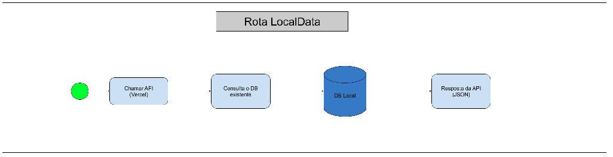

# TechChallenge API

Este é um projeto de API desenvolvido com FastAPI, que inclui faz web scraping e salvar dados de exportação de uvas e vinhos.
Os dados são retirados da página da [Embrapa](http://vitibrasil.cnpuv.embrapa.br/index.php?opcao=opt_01)

## 🚀 Funcionalidades

- **Web Scraping**: Extrai informações dos dados de vitivinicultura da Embrapa usando BeautifulSoup.
- **Base Local**: Salva as informações extraídas em Database Local do sqlite3.
- **Documentação**: Documentação automática da API com Swagger.

## 📁 Estrutura do Projeto

```bash
intro_api/
├── config/
├── data/
├── images/
├── routers
│   ├── __init__.py
│   ├── localdata.py
│   └── webdata.py
└── utils
    ├── databases.py
    ├── __init__.py
    └── webscrapping.py
├── main.py
├── README.md
├── requirements.txt
└── TechChallenge01.db
```

- **`config/`**: Contém arquivos de configuração da estruturas das tabelas e páginas.
- **`images/`**: Imagens das arquiteturas para o README.
- **`routes/`**: Contém as rotas organizadas por funcionalidades.
- **`services/`**: Serviços para lógica de negócios, como scraping.
- **`main.py`**: Código principal para rodar a API.
- **`requirements.txt`**: Lista de dependências do projeto.
- **`README.md`**: Documentação do projeto.

## Fluxo de Funcionamento da API

Foram criadas duas rotas para a API:
1 - A rota web baixa os dados do site da EMBRAPA, salva em base local, ou atualiza essa base, e envia os dados para o cliente.
2 - A rota local faz a aquisição dos dados salvos localmente e os envia para o cliente.




## Arquitetura de Caso de Uso


## Google Collab buscando dados da API

[Google Colab](https://colab.research.google.com/drive/1th5pb1I35dywcHTtesanzCuJHD49PjYP?usp=sharing)

## 🛠️ Como Executar o Projeto

### 1. Clone o Repositório

```bash
git clone https://github.com/sonogodo/API_G33
cd API_G33
```

### 2. Crie um Ambiente Virtual

```bash
python -m venv venv
source venv/bin/activate  # No Windows: venv\Scripts\activate
```

### 3. Instale as Dependências

```bash
pip install -r requirements.txt
```

### 4. Execute a API

```bash 
uvicorn main:app --reload
```

O aplicativo estará disponível em `http://localhost:8000`.


## 📖 Documentação da API

A documentação da API é gerada automaticamente com Swagger e está disponível em `http://localhost:8000/docs/`.

São 4 parâmetros passados para API, o nome da tabela, o ano mínimo, o ano máximo e a API_KEY
Como padrão os parêmetros estão configurados da seguinte forma:
```
{
    page: "Comercializacao",
    ano_min: 2010,
    ano_max: 2023,
    api_key: ""
}
```

Para coletar todos os dados é só colocar o parâmetro page como "All"
As páginas aceitas são:
    - All (retorna todas as páginas)
    - Comercializacao
    - Producao
    - Processamento
    - Importacao
    - Exportacao

Caso a página passada seja diferente dessas, a página Comercializacao retornará como padrão.
